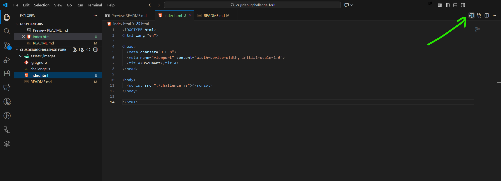
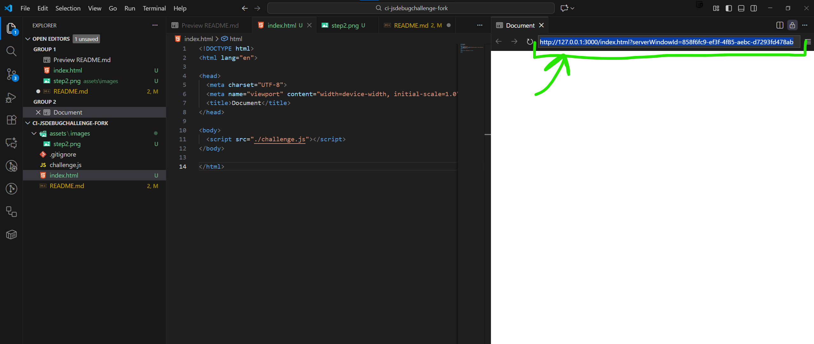

# jsdebugchallenge

## How to run me in your browser w/ "Live Reload"

1. Open `index.html` in VS Code.
2. Open the preview tab as shown in the **first** screenshot below.
3. Copy this link shown in **screenshot 2** and open it into Google Chrome.
4. Open Devtools in Chrome (F12 or right click -> Inspect).
5. Open the "Sources" tab in Devtools.
6. Edit `challenge.js` **in VS Code** and see the changes reflected immediately in the browser.
7. Place debuggers down as previously shown in the LMS content.

### Known Issues

-   If your browser freezes and right click doesn't work in the Google Chrome tab, please use the **other** method of running an HTTP server locally as shown in the LMS content. (The "python -m http.server" one.)

### Screenshots

### Step 2 Screenshot

### Step 3 Screenshot

